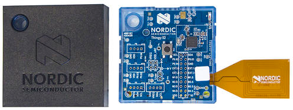

# Thingy:52™ sample macros

nRF Connect 4.12 added basic support for the [Thingy:52](https://www.nordicsemi.com/thingy). 

When you connect to a Thingy for the first time, number of sample macros will be added to *Thingy Demo* folder. You will also find them here in case you removed accidently some of them from the app. Also, you are free to do a PR with your own Thingy macros.