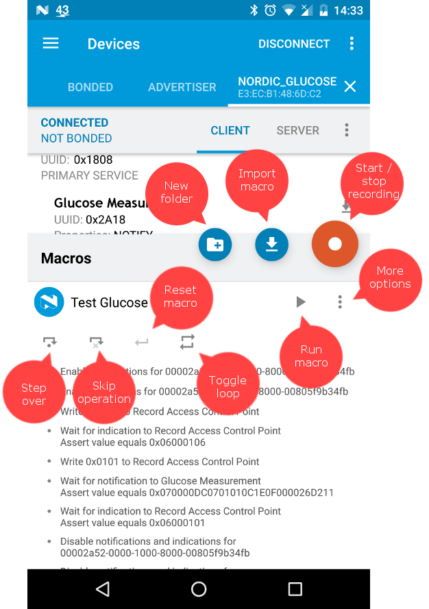

# Macros

Starting from nRF Connect version 4.4.0 you may now record and run sets of operations with a single tap of a button.

Macros can be exported to XML and imported on another device.

## Usage

After you connect to a device, tap the red floating action bar at the bottom-right corner of the screen. A macros sheet will pop up.
You will find there the Tutorial folder with 3 sample macros. Click the Tutorial folder row to go inside.

Each of the 3 sample macros demonstrates some features. It is recommended to complete them to get a general overview about Macros.
Tap a macro row to expand it and see operation list. You may also export each macro to XML and see how has it been built.

The last sample requires enabling GATT Server and selecting the Sample configuration. To do that open the Navigation drawer by pressing
the hamburger icon (top-left corner of the screen), tap *Configure GATT Server* and then select *Sample configuration* from the drop down list at the top.
After the configuration is set, go back to the previous screen using a Back button. The third sample should now be available.

On the screenshot below, you will find some basic information how to record or import a macro, and how to run macros and operations:



If a macro is not compatible with the device services, an information will be displayed with a short error message.

If macro was loaded successfully, each operation is marked with a gray dot. Tapping a *Step Over* icon will excute the next operation. Operation may end with success, warning or an error. Some operations may validate the incoming data. If the data received is different from data obtained during recording, an orange triangle will be shown. You may then check what went wrong in the log pane.

When operation finishes successfully the dot will change color to blue. If it fails - to red.

You may also skip the next operation using the *Skip operation* button, or run the whole macro with *Run macro* button. To run a macor in a loop, select the *Loop* icon (it will change color to blue).

## Documentation

After exporting a macro to XML it can be modified and imported again (make sure the name is different, or remove the previous macro as names must be unique).

A macro is defined in the XML format in **macro** node. The macro structure is shown below:

```xml
<macro name="NAME" icon="ICON">
	<!-- List of server asserts. Those services are checked on the GATT Server on the Android device. These nodes are optional. -->
	<assert-server-service [description="DESCRIPTION"] uuid="SERVICE_UUID" [instance-id="0_BASED_ID"]>
		<!-- Each service assert may assert 0+ characteristics -->
		<assert-characteristic [description="DESCRIPTION"] uuid="CHAR_UUID" [instance-id="0_BASED_ID"]>
			<!-- 
				A characteristic assert may also check characteristic's properties.

				Property name is case-sensitive and must be one of the following: 
					- BROADCAST
					- READ
					- WRITE
					- WRITE_WITHOUT_RESPONSE
					- NOTIFY
					- INDICATE
					- SIGNED_WRITE
					- EXTENDED_PROPERTIES

				Requirement name is also case-sensitive and must be one of the following:
					- MANDATORY 
					- OPTIONAL
					- EXCLUDED
    		-->
    		<property name="NAME" [requirement="VALUE"] />

    		<!-- Descriptors may also be asserted. -->
    		<assert-descriptor uuid="DESC_UUID" [instance-id="0_BASED_ID"]/>

    		<!-- To assert the Client Characteristic Configuration descriptor a shorter form may be used. -->
    		<assert-cccd/>
		</assert-characteristic>
	</assert-server-service>

	<!-- List of device service asserts. The following services are required on the connected device. These nodes are optional. -->
	<assert-service [description="DESCRIPTION"] uuid="SERVICE_UUID" [instance-id="0_BASED_ID"]>
		<!-- Each service assert may assert 0+ characteristics -->
		<assert-characteristic [description="DESCRIPTION"] uuid="CHAR_UUID" [instance-id="0_BASED_ID"]>
			<!-- Just like above a characteristic assert may also check characteristic's properties. -->
    		<property name="NAME" [requirement="VALUE"] />

    		<!-- Descriptors may also be asserted. -->
    		<assert-descriptor uuid="DESC_UUID" [instance-id="0_BASED_ID"]/>

    		<!-- To assert the Client Characteristic Configuration descriptor a shorter form may be used. -->
    		<assert-cccd/>
		</assert-characteristic>
	</assert-service>

	<!-- Non-empty list of operations. Please, find types of operations below. -->
</macro>
```

### Name and icon

A macro must have a name and an icon specified. The name must be unique - if there is another macro or a folder with the same name importing it will fail.

The icon may have one of the following values:

- LEFT
- UP
- HOME
- DOWN
- RIGHT
- REWIND
- PLAY
- PAUSE
- STOP
- FORWARD
- MAGIC
- PHYSICAL_WEB
- EDDYSTONE
- NORDIC
- LOCK
- ALARM
- SETTINGS
- STAR
- PLUS
- MINUS
- BRIGHTNESS_HIGH
- BRIGHTNESS_LOW
- DOWNLOAD
- UPLOAD
- PRINT
- FLASH
- FLASH_OFF
- LED_ON
- LED_OFF
- BATTERY
- INFO
- MESSAGE
- ROCKET
- PARACHUTE
- PIKACHU
- NUMBER_1
- NUMBER_2
- NUMBER_3
- NUMBER_4
- NUMBER_5
- NUMBER_6
- NUMBER_7
- NUMBER_8
- NUMBER_9
- CLOSE

### Service assertion

A macro may have zero or more **assert-server-service** or **assert-service** in random order.

These two sections (one for the Server and one for Client) are added automatically by nRF Connect when imported, based on the services, characteristics and descriptors used in the macro. More restrictive asserts may be created by the user (for example to ensure presense of a characteristic that is not used by macro).

A sample XML structure is shown above.

### Operations

This chapter lists operations that are currently supported by nRF Connect. Based on their functionality they are divided into these groups:

- Client operations
- Server operations
- Other

The XML representation of a macro is similar to one used by [Automated tests](../Automated tests/README.md). This allows macros be converted to tests. However not all of oppeartions or attributes are supported in Automated tests. Also, Automated tests allow operations like **connect**, **discover-services**, **disconnect**, **dfu**, etc., or attributes like **espected** or **timeout**, which are not supported by macros.

All **instance-id** attributes are optional and set to 0 by default.

#### Client operations

The following opertations are using the remote device attributes and may be used to write or read data to device's characteristics or descriptors, or to wait for notifications.

##### Read characteristic

```xml
<read [description="DESCRIPTION"] service-uuid="SERVICE_UUID" [service-instance-id="SII"] characteristic-uuid="CHAR_UUID" [characteristic-instance-id="CIU"]>
  <!-- Assert characteristic value -->
  <assert-value [description="DESCRIPTION"] value="BYTES"|value-string="TEXT" />
</read>
```

The **read** operation reads the value of the characteristic. A value assertion may be defined as a child node.

##### Read descriptor

```xml
<read-descriptor [description="DESCRIPTION"] uuid="DESCRIPTOR_UUID" [descriptor-instance-id="ID"] service-uuid="SERVICE_UUID" [service-instance-id="SII"] characteristic-uuid="CHAR_UUID" [characteristic-instance-id="CII"]>
  <!-- Assert characteristic value -->
  <assert-value [description="DESCRIPTION"] value="BYTES"|value-string="TEXT" />
</read-descriptor>
```

Reads the value of the descriptor with given UUID and asserts its value.

##### Write characteristic

```xml
<!-- 
  The type value is case-sensitive and may have one of the following values:
  - WRITE_REQUEST (default) - Write With Response
  - WRITE_COMMAND - Write Without Response
-->
<write [description="DESCRIPTION"] service-uuid="SERVICE_UUID" [service-instance-id="SII"] characteristic-uuid="CHAR_UUID" [characteristic-instance-id="CII"] [type="TYPE"] value="BYTES"|value-string="TEXT" />
```

Writes the given value to the characteristic on a remote device.

##### Write descriptor

```xml
<write-descriptor [description="DESCRIPTION"] uuid="DESCRIPTOR_UUID" [descriptor-instance-id="ID"] service-uuid="SERVICE_UUID" [service-instance-id="SII"] characteristic-uuid="CHAR_UUID" [characteristic-instance-id="CII"] value="BYTES"|value-string="TEXT" />
```

Writes the given value to the descriptor on a remote device.

##### Notifications

```xml
<wait-for-notification [description="DESCRIPTION"] service-uuid="SERVICE_UUID" [service-instance-id="SII"] characteristic-uuid="CHAR_UUID" [characteristic-instance-id="CII"]>
  <!-- Assert characteristic value -->
  <assert-value [description="DESCRIPTION"] value="BYTES"|value-string="TEXT" />
</wait-for-notification>
```

Waits for a notification from a characteristic with given parameters. A value assertion may be used to check its value.

##### Indications

```xml
<wait-for-indication [description="DESCRIPTION"] service-uuid="SERVICE_UUID" [service-instance-id="SII"] characteristic-uuid="CHAR_UUID" [characteristic-instance-id="CII"]>
  <!-- Assert characteristic value -->
  <assert-value [description="DESCRIPTION"] value="BYTES"|value-string="TEXT" />
</wait-for-indication>
```

Waits for a indication from a characteristic with given parameters. A value assertion may be used to check its value.

##### Sleep If

```xml
<sleep-if [description="DESCRIPTION"] service-uuid="SERVICE_UUID" [service-instance-id="SII"] characteristic-uuid="CHAR_UUID" [characteristic-instance-id="CII"] value="BYTES"|value-string="TEXT" [timeout="NUMBER"] [server="BOOLEAN"]/>
```

Waits if value of the given characteristic is equal to the given one. Timeout may be set to force stop waiting. The default timeout equals 0 (no timeout). A value containing only 0s is equal to no value. If the characteristic value was different than given one when operation started the operation ends immediately.

Works both for Client and Server characteristics. For Client characteristics notifications should be enabled for given characteristic (otherwise value can't change). For Server the ```server``` flag must be set to *true* and the characteritic should be writable (WRITE or WRITE_NO_RESPONSE properties). 

##### Sleep Until

```xml
<sleep-until [description="DESCRIPTION"] service-uuid="SERVICE_UUID" [service-instance-id="SII"] characteristic-uuid="CHAR_UUID" [characteristic-instance-id="CII"] value="BYTES"|value-string="TEXT" [timeout="NUMBER"] [server="BOOLEAN"]/>
```

Waits until value of the given characteristic is equal to the given one. Timeout may be set to force stop waiting. The default timeout equals 0 (no timeout). A value containing only 0s is equal to no value. If the characteristic value was equal to than given one when operation started the operation ends immediately.

Works both for Client and Server characteristics. For Client characteristics notifications should be enabled for given characteristic (otherwise value can't change). For Server the ```server``` flag must be set to *true* and the characteritic should be writable (WRITE or WRITE_NO_RESPONSE properties).

##### Special operation - Unlock Eddystone

```xml
<!-- 
  The type value is case-sensitive and may have one of the following values:
  - WRITE_REQUEST (default) - Write With Response
  - WRITE_COMMAND - Write Without Response
-->
<unlock-eddystone [description="DESCRIPTION"] service-uuid="SERVICE_UUID" [service-instance-id="SII"] characteristic-uuid="CHAR_UUID" [characteristic-instance-id="CII"] [type="TYPE"] key="16_BYTE_KEY" />
```

The **unlock-eddystone** command may be sent only to the *Unlock* characteristic of the [Eddystone Configuration Service](https://github.com/google/eddystone/tree/master/configuration-service). It must be preceded with **read** operation on the same characteristic in order to read the challenge value. When executed, it will encrypt the challenge using the provided 16-byte key and send the result to unlock the beacon.

#### Server operations

The following operations are using the Android device's GATT Server configuration.

##### Wait for read characteristic

```xml
<wait-for-read [description="DESCRIPTION"] service-uuid="SERVICE_UUID" [service-instance-id="SII"] characteristic-uuid="CHAR_UUID" [characteristic-instance-id="CIU"]/>
```

nRF Connect will wait until the given characteristic is be read from a remote device.

The value of the characteristic is not validated.

##### Wait for read descriptor

```xml
<wait-for-read-descriptor [description="DESCRIPTION"] uuid="UUID" [descriptor-instance-id="ID"] service-uuid="SERVICE_UUID" [service-instance-id="SII"] characteristic-uuid="CHAR_UUID" [characteristic-instance-id="CIU"]/>
```

nRF Connect will wait until the given descriptor is be read from a remote device.

The value of the characteristic is not validated.

##### Wait for write characteristic

```xml
<wait-for-write [description="DESCRIPTION"] service-uuid="SERVICE_UUID" [service-instance-id="SII"] characteristic-uuid="CHAR_UUID" [characteristic-instance-id="CIU"]>
  <!-- Assert characteristic value -->
  <assert-value [description="DESCRIPTION"] value="BYTES"|value-string="TEXT" />
</wait-for-write>
```

nRF Connect will wait until the given characteristic is written from a remote device. A value assertion may be used to check its value.

##### Wait for write descriptor

```xml
<wait-for-write-descriptor [description="DESCRIPTION"] uuid="UUID" [descriptor-instance-id="ID"] service-uuid="SERVICE_UUID" [service-instance-id="SII"] characteristic-uuid="CHAR_UUID" [characteristic-instance-id="CIU"]>
  <!-- Assert characteristic value -->
  <assert-value [description="DESCRIPTION"] value="BYTES"|value-string="TEXT" />
</wait-for-write-descriptor>
```

nRF Connect will wait until the given descriptor is written from a remote device. A value assertion may be used to check its value.

##### Set server characteristic value

```xml
<set-value [description="DESCRIPTION"] service-uuid="SERVICE_UUID" [service-instance-id="SII"] characteristic-uuid="CHAR_UUID" [characteristic-instance-id="CII"] value="BYTES"|value-string="TEXT" />
```

Sets a value of a server characteristic. The value may then be read by the remote device.

##### Set server descriptor value

```xml
<set-descriptor-value [description="DESCRIPTION"] uuid="DESCRIPTOR_UUID" [descriptor-instance-id="ID"] service-uuid="SERVICE_UUID" [service-instance-id="SII"] characteristic-uuid="CHAR_UUID" [characteristic-instance-id="CII"] value="BYTES"|value-string="TEXT" />
```

Sets a value of a server descriptor. The value may then be read by the remote device.

##### Send notifications

```xml
<send-notification [description="DESCRIPTION"] service-uuid="SERVICE_UUID" [service-instance-id="SII"] characteristic-uuid="CHAR_UUID" [characteristic-instance-id="CII"] value="BYTES"|value-string="TEXT" />
```

Sends a notification with the given value from the server characteristic.

##### Send indications

```xml
<send-indication [description="DESCRIPTION"] service-uuid="SERVICE_UUID" [service-instance-id="SII"] characteristic-uuid="CHAR_UUID" [characteristic-instance-id="CII"] value="BYTES"|value-string="TEXT" />
```

Sends an indication with the given value from the server characteristic.

#### Other

The following operations do not depend on any GATT attribute.

##### Sleep

```xml
<sleep [description="DESCRIPTION"] timeout="NUMBER" />
```

Waits a NUMBER value of milliseconds without doing anything.

##### Read RSSI while connected

```xml
<read-rssi [description="DESCRIPTION"]/>
```

Reads the RSSI value of the given (or default) target.

##### Request MTU change

```xml
<request-mtu [description="DESCRIPTION"] value="MTU"/>
```

Sends a MTU change request to the peripheral. MTU value must be between 23 and 517 inclusive.

*Note:* Supported only on Android 5 and never devices.

##### Request Connection Priority change

```xml
<!-- 
  Property type is case-sensitive and must be one of the following: 
  - LOW_POWER (Conn interval: 100-125ms, slave latency: 2, supervision timeout multiplier: 20)
  - BALANCED (default) (Conn interval: 30-55ms, slave latency: 0, supervision timeout multiplier: 20)
  - HIGH (Conn interval: 11.25-15ms on Android 6+ or 7.5-10ms before, slave latency: 0, supervision timeout multiplier: 20)
-->
<request-connection-priority [description="DESCRIPTION"] type="TYPE"/>
```

Requests the change of connection priority. Only the 3 given values are supported by Android API. 

This is not an asynchronuous method and will always end with a success, unless a serious problem occur. It does not mean that the requested 
parameters has been set.

*Note:* Supported only on Android 5 and never devices.