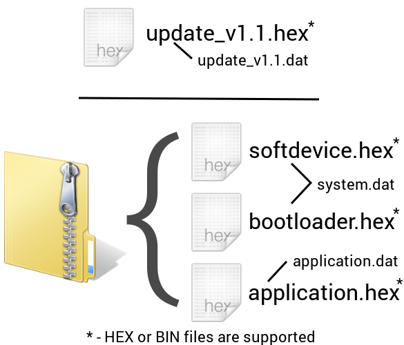

# Automated tests

The automated tests are now in BETA version. It has been tested but some issues may occur. Fill free to submit comments, bugs or feature ideas.

## Resources

1. [test.bat](test.bat) - the Windows script that may be used to run the test on the Android device.
2. [sample_test_hrm.xml](sample_test_hrm.xml) - the sample test. It contains all supported features with some in-code documentation. It matches the HRS_DFU sample application from the SDK. You may modify it to match your application.

## How to begin

The automated tests should work with any Bluetooth Smart device that's use the GATT protocol. A test XML can be created to test it the services, characteristics and descriptors have the correct values and behaviour. A Device Firmware Update (DFU) also may be performed. 

To make an easy start the *sample_test_hrm.xml* file contains a test that can be used with the HRS_DFU sample from the SDK. The instruction below describes steps that should be performed to successfully run this test. 

**Note:** Starting from the SDK 8.0 the bootloader, in case the buttonless update is NOT being used, advertises with a device address increased by 1. Therefore, the test may fail in the first run if you have just the Soft Device and Bootloader flashed on the device. After flashing the HRS application onto it, it will start to advertise with a different address and a timeout will be thrown during connection attempt. But the test should work for the second time as the bootloader uses the same address if buttonless update is in use.

1. nRF Master Control Panel (v2.1 or newer) will create the above files in your phone's file system in */Nordic Semiconductor* folder. **Note:** newly created files may not be visible on the PC when connected with USB. This is beacuse Android must perform a scan of media files. Get the files from GitHub or trigger the media scanner manually: restart the phone/tablet or install and launch the *Rescan SD* application (or similar) from Google Play.
2. Copy those files to your PC. You will use the *test.bat* to start the testing service. The sample may be used as a demo or a starting point.
3. To prepare the nRF51 DK for the test flash the Soft Device and the DFU bootloader.
  1. Flash the Soft Device s110 version 7.1.0 or newer (for example using nRF Go Studio)
  2. Flash the DFU Bootloader from SDK 7.1 or newer (both SD and Bootloader are available on http://www.nordicsemi.com website)
    - If you want to use the buttonless update in DFU bootloader from SDK 7.1, modify the *dfu_transport_ble.c* file in your bootloader source (you may have to unlock the file in Explorer first as it's READ ONLY by default). 
    - Increase the **APP_DIRECTED_ADV_TIMEOUT** value to 50 (it's 5 by default) in line 62: `#define APP_DIRECTED_ADV_TIMEOUT             50`
    - Compile the modified Bootloader and flash the new HEX.
    - This change is required for the Android to reconnect to the bootloader after switching the device to bootloader mode. By default, the bootloader advertises for 6 seconds (5 * 1.28s) which is shorter than the disconnection timeout on Android. The Android, after sending *jump* command, waits for the disconnection event about 22 seconds, depending on the device model. Value 50 (1 minute) should be more than enough.
    - Note: this change is not be required for newer versions of the DFU bootloader.
4. Connect your Android device to the PC, enable USB debugging on it and install required drivers and ADB (Android Debug Bridge) on the PC. Add the ABD to the PATH global variable or copy it (and dlls) to the same folder.
5. Try the ADB by writing `adb devices` command in the command line. A list of connected Android devices should be shown.
6. Find out the address of your device. You may use the nRF Master Control Panel to do that. Your device should advertise as a DFU Targ. Make sure you are not connected with the bootloader.
7. Optional: install the [nRF Logger](https://play.google.com/store/apps/details?id=no.nordicsemi.android.log) application to get more information about the test progress and syntax errors.
8. Start the sample test with the following command. Use your device address, f.e. AA:BB:CC:DD:EE:FF instead of address*. The -d option is required only when more than one Android device is connected and configured for USB debugging.

    `test.bat [-d your_android_device_id] -E EXTRA_ADDRESS address* sample_test_hrm.xml`

9. A *Test in progress...* notification will be shown. If you had the nRF Logger installed click the notification to display the test progress.
10. When test is completed the *sample_test_hrm_result.txt* file will be created in the script location. The result of the sample HRM test is [here](sample_test_hrm_result.txt).

## Documentation

The test suite is defined in XML in the **test-suite** node. The basic test suite structure is shown below:

```xml
<test-suite>
  <!-- Definitions (0+) -->
  <set name="KEY" value="VALUE" /> 
  ...
  <!-- Target(s) (1+) -->
  <target id="TARGET_ID" name="TARGET_NAME" address="AA:DD:DR:RE:ES:SS" />
  ...
  <!-- Test definition(s) (1+) -->
  <test id="TEST_ID" description="DESCRIPTION" [target="TARGET_ID"]>
    ...
  </test>
  ...
  
  <!-- Run test command(s) (1+) -->
  <run-test ref="TEST_ID" description="DESCRIPTION">
    <!-- Optional constants redefinition (0+) -->
    <set name="KEY" value="OTHER_VALUE" />
  </run-test>
  ...
</test-suite>
```

#### Targets

A test suite may test one or more devices. A default target may be set for the test and/or specified for each operation (see below). The operation's target, if specified, overwrites the test target.

#### Operation expected result

Each operation in the test may end with SUCCESS, WARNING or FAIL. If the operation fails the test is aborted and the device is being disconnected. Warning does not abort the test but the cause of the warning is logged. In addition the expected result for each operation may be specified using **expected** attribute. Using this attribute a test can check some conditions that should not happen. This attribute may have one of the following values:

- SUCCESS                 - success is required to go on (default)
- SUCCESS_WARNING_ON_FAIL - a warning will be logged in the result file but the test will continue
- FAIL                    - a fail is required to proceed
- FAIL_WARNING_ON_SUCCESS - a fail is expected but in case of a success a warning will be logged to the result file. 
 
#### Timeouts

Each operation, except **dfu** may have the timeout specified. The default timeout for each is set to 5000ms and may be changed using the **timeout="NUMBER"** attribute. The number is in milliseconds.

#### Operations

The fillowing operations are currently supported:

##### Connect

```xml
<connect [description="DESCRIPTION"] [timeout="NUMBER"] [target="TARGET_ID"] />
```

This operation must be defined if a test should connect to the device. The only operations that do not need the connection are **bond** and **dfu**. If you forget to add the **connect** tag an error will occur and the test ask you whether you did not forget to connect.

The **connect** operation is folowed by 1 second break to give Android some time before the next operation. This seconds may be used f.e. for re-establishing bond and/or starting the service discovery.

##### Service Discovery

```xml
<discover-services [description="DESCRIPTION"] [timeout="NUMBER"] [target="TARGET_ID"] />
```

To be able to assert, read or write characteristics a **discover-services** operation must be specified. This will cause the service discovery on the device. However, if services are already known and cached, the cached list will be returned. Please, use the **refresh** operation to clear the cache.

##### Refresh

```xml
<refresh [description="DESCRIPTION"] [timeout="NUMBER"] [target="TARGET_ID"] />
```

This operation clears the device services cache. It's using the hidden Android method *BluetoothGatt#refresh()* which may be removed from the API in the future. It may be useful when multiple different BLE applications are being flashed on the same Bluetooth Smart device (f.e. DK).

This method must be called after the device has been connected at least once in the test using the **connect** operation. Otherwise an error message will be shown. This is because it is being invoked on a *BluetoothGatt* object which is created using *connectGatt(..)* method.

The **refresh** operation is folowed by 1 second break to give Android some time before the next operation. The break may be used to start the Android-internal service discovery.

##### Disconnect

```xml
<disconnect [description="DESCRIPTION"] [timeout="NUMBER"] [target="TARGET_ID"] />
```

Each device used in the test is automatically disconnected when the test ends (no matter the result). However, when a diconnection is to be a part of the test this operation may be used.

##### Assert services and characteristics

```xml
<assert-service [description="DESCRIPTION"] [target="TARGET_ID"] uuid="SERVICE_UUID" [instance-id="INSTANCE_ID"] [target="TARGET_ID"] [expected="SUCCESS"] >
  <!-- Assert the characteristic in this service -->
  <assert-characteristoc [description="DESCRIPTION"] [target="TARGET_ID"] uuid="CHAR_UUID" [instance-id="INSTANCE_ID"] [expected="SUCCESS"]>
    <!-- Assert characteristic properties -->
    <property name="NOTIFY" [requirement="MANDATORY"] />
    <!-- It may also have some other properties (this section may be skipped as this is does not do any checking -->
    <property name="READ" requirement="OPTIONAL" />
    <!-- But for sure it must not have those properties -->
    <property name="WRITE" requirement="EXCLUDED" />
    <property name="WRITE_WITHOUT_RESPONSE" requirement="EXCLUDED" />
    <!-- 
			Property name is case-sensitive and must be one of the following: 
				- BROADCAST
				- READ
				- WRITE
				- WRITE_WITHOUT_RESPONSE
				- NOTIFY
				- INDICATE
				- SIGNED_WRITE
				- EXTENDED_PROPERTIES

			Requirement name is also case-sensitive and must be one of the following:
				- MANDATORY (default)
				- OPTIONAL
				- EXCLUDED
    -->
    <property name="SIGNED_WRITE" requirement="EXCLUDED" />
    <!-- This characteristic should have the CCCD descriptor. Attribute 'instance-id' is optional -->
    <assert-descriptor [description="Checking ${DESC_NAME} descriptor"] uuid="${CCCD_UUID}" [expected="SUCCESS"] />
    <!-- We may also check if the characteristic has Client Characteristic Configuration with assert-cccd command -->
    <assert-cccd [description="Another way of checking only the CCCD"] [expected="SUCCESS"]>
      <!-- And even check the value of any descriptor, including the CCCD -->
      <assert-value [description="Check if notifications are disabled by default"] value="BYTES"|value-string="TEXT" [expected="SUCCESS"] />
    </assert-cccd>
    <!-- 
			The following descriptor should not be in this characteristic.

			An 'expected' attribute may be set to all operations (except 'property' and 'sleep') to specify the expected result.
			Expected result may be one of the following:
				- SUCCESS                 - success is required to go on (default)
				- SUCCESS_WARNING_ON_FAIL - a warning will be logged in the result file but the test will continue
				- FAIL                    - a fail is required to proceed
				- FAIL_WARNING_ON_SUCCESS - a fail is expected but in case of a success a warning will be logged to the result file.
	-->
    <assert-descriptor [description="This descriptor should not be found"] uuid="00002906-0000-1000-8000-00805f9b34fb" [expected="FAIL"] />
  </assert-characteristic>
</assert-service>
```

The **assert-service** operation and its child nodes may be used to validate the proper configuration of the device. For all assert operations an **expected** attribute may be specified (see above).

Remember that before you read the characteristic its value is *null* (null is equal to 00+, as on the example above or to an empty string). The only exception are the CCCD descriptors for bonded devices. When notifications or indications were enabled in the previuos connection the value of the descriptor is saved in application's database and will not change. However, there is no guarantee that that is the real value of the descriptor on the target device unless the **read-descriptor** operation will be executed.

The value may be given in bytes using the **value** attribute, or as a string using **value-string**.

##### Bond

```xml
<bond [description="DESCRIPTION"] [timeout="NUMBER"] [target="TARGET_ID"] [expected="SUCCESS"] />
```

Bonds to the device. This operation may be called even when the device is not connected.

##### Unbond

```xml
<unbond [description="DESCRIPTION"] [timeout="NUMBER"] [target="TARGET_ID"] [expected="SUCCESS"] />
```

Removes the bond information from the phone/tablet. This operation may be called even when the device is not connected and will cause disconnection when invoked on connected device.

##### Read characteristic

```xml
<read [description="DESCRIPTION"] service-uuid="SERVICE_UUID" [service-instance-id="SII"] characteristic-uuid="CHAR_UUID" [characteristic-instance-id="CIU"] [timeout="NUMBER"] [target="TARGET_ID"] [expected="SUCCESS"]>
  <!-- Assert characteristic value -->
  <assert-value [description="DESCRIPTION"] value="BYTES"|value-string="TEXT" [expected="SUCCESS"] />
</read>
```

The **read** operation reads the value of the characteristic. A value assertion may be defined as a child node.

The instance-id attributes are optional and set to 0 by default.

##### Read descriptor

```xml
<read-descriptor [description="DESCRIPTION"] uuid="DESCRIPTOR_UUID" service-uuid="SERVICE_UUID" [service-instance-id="SII"] characteristic-uuid="CHAR_UUID" [characteristic-instance-id="CII"] [timeout="NUMBER"] [target="TARGET_ID"] [expected="SUCCESS"]>
  <!-- Assert characteristic value -->
  <assert-value [description="DESCRIPTION"] value="BYTES"|value-string="TEXT" [expected="SUCCESS"] />
</read-descriptor>
```

Reads the value of the descriptor with given UUID and asserts its value.

The instance-id attributes are optional and set to 0 by default.

##### Write characteristic

```xml
<write [description="DESCRIPTION"] service-uuid="SERVICE_UUID" [service-instance-id="SII"] characteristic-uuid="CHAR_UUID" [characteristic-instance-id="CII"] value="BYTES"|value-string="TEXT" [timeout="NUMBER"] [target="TARGET_ID"] [expected="SUCCESS"] />
```

Writes the given value to the characteristic.

The instance-id attributes are optional and set to 0 by default.

##### Write descriptor

```xml
<write-descriptor [description="DESCRIPTION"] uuid="DESCRIPTOR_UUID" service-uuid="SERVICE_UUID" [service-instance-id="SII"] characteristic-uuid="CHAR_UUID" [characteristic-instance-id="CII"] value="BYTES"|value-string="TEXT" [timeout="NUMBER"] [target="TARGET_ID"] [expected="SUCCESS"] />
```

Writes the given value to the descriptor.

The instance-id attributes are optional and set to 0 by default.

##### Notifications / indications

```xml
<assert-notification [description="DESCRIPTION"] service-uuid="SERVICE_UUID" [service-instance-id="SII"] characteristic-uuid="CHAR_UUID" [characteristic-instance-id="CII"] [timeout="NUMBER"] [target="TARGET_ID"] [expected="SUCCESS"]>
  <!-- Assert characteristic value -->
  <assert-value [description="DESCRIPTION"] value="BYTES"|value-string="TEXT" [expected="SUCCESS"] />
</assert-notification>
```

Waits NUMBER of milliseconds for a notification from a characteristic with given parameters. A value assertion may be used to check its value.

The instance-id attributes are optional and set to 0 by default.

##### Read RSSI while connected

```xml
<read-rssi [description="DESCRIPTION"] [timeout="NUMBER"] [target="TARGET_ID"] [expected="SUCCESS"]>
  <!-- Assert RSSI value range -->
  <assert-value [description="DESCRIPTION"] value="NUMBER (e.g. -50)|LESS THNN (e.g. -50-)|GREATER THAN (e.g. -50+)" [expected="SUCCESS"] />
</read-rssi>
```

Reads the RSSI value of the given (or default) target. The RSSI value may be validated using the **assert-value** tag. In order to check whether the device signal is strong use '''value="-50+"''' attribute. The test will pass if the RSSI is higher (the signal is stronger) than -50 dBm. Be aware that the RSSI value may vary from test to test. Using a expected="SUCCESS_WARNING_ON_FAIL" is recommended.

The device must be connected to read the RSSI as scanning is not yet supported in automated tests.

##### Sleep

```xml
<sleep [description="DESCRIPTION"] [timeout="NUMBER"] />
```

Waits a NUMBER value of milliseconds without doing anything. Always results with SUCCESS.

##### DFU - Device Firmware Update

```xml
<!-- 
  You may upload an application, bootloader, soft device or multiple files. Use 'type=X' attribute where X may be one of the following:
  * 1 - for soft device
  * 2 - for bootloadere
  * 4 - for application
  * 0 - for auto (all from ZIP or an application) (default)
-->
<dfu [description="DFU operation"] file="${FIRMWARE_PATH}" [initFile="${FIRMWARE_INIT_PATH}"] [type="TYPE_NUMBER"] [target="TARGET_ID"] [expected="SUCCESS"] />
```

The **dfu** operation sends the firmware Over-the-Air to the target using DFU. In case of a DFU Bootloader from SDK 7.0+ the init file is required. Check the [How to create Init file for DFU](../init packet handling/README.md) for details.

The script may send the Soft Device, Bootloader or the application, or any combinations of those packed in a ZIP file. The new Distribution packets (recommended) are supported since nRF Master Control Panel version 3.0, however you may also use the ZIP file that contains the following content in order to be parsed correctly:


