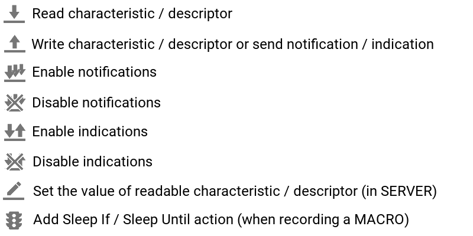

# Documentation

## nRF Connect for Android

The nRF Connect is an application designed for Bluetooth Low Energy developers. It allows for scanning for BLE devices and communicating with them.

### Permissions

* **Location permission** is required on Android Marshmallow onwards in order to scan for Bluetooth LE device. The reason behind it is that some BLE devices, called Beacons, can be used to estimate user's location. The app will not use location information in any way. The app will still work without this permission, but scanning will not work. However, you may still connect and use your bonded devices, or those that are already connected.

* **Storage permission** is used to save some files on the local file system. Granting this permission is optional, but required if user want's to save a log into a file, export a Macro or GATT Server Configuration.

* **Location Service** is required to be enabled for the same reason as **Location permission**. This is a requirement on Android devices since Marshmallow. Some manufacturers, for example Samsung, require it from Android Pie.

## Scanner

The Scanner tab list all Bluetooth LE devices in range. Use *Filter* to narrow down the list to devices of interest. Different filtering options are available: by name or by MAC address, by advertising data or RSSI. Also, you may exclude some types of devices.

Use the **CONNECT** button to connect to the device. Starting form Android Oreo, the **CONNECT** button will appear only on connectable devices. On older system versions it is shown for all devices due to API limitations. In such case, connecting with a non-connectable device will timeout after 30 seconds.

Use the 3 dots button on **CONNECT** button to see more connection options:
* Connect with *autoConnect*,
* Connect with preferred PHY (available on newer phones with Android Oreo onwards),
* Bond / Remove bond information.

Swipe the list to the right (or select menu -> Show RSSI graph) to see average RSSI graph.

Click a row to expand it and see detailed advertising data. Some records, indicated with blue title, allow you to change the parser.

Click **RAW** button to see raw advertising data splitted into records.

The **MORE** button allows you to see detailed history of packets from that device. If a number parser (Int, Float, Temperature, Pressure, etc.) has been selected for at least one record, a tab will be shown showing the history of this value over time.

The **CLONE** button, available on Android Lollipop onwards, allows to clone the packet data to make the phone advertise with (almost) the same data. Exact cloning is not possible due to API limitations on Android.

If the advertising packet contains a URL (for example a [Physical Web](https://google.github.io/physical-web/) beacon), a **OPEN** button will appear allowing to open the website in a browser.

Long tap a device to select it. Additional options will be available on the top menu. You may assign a name to a device or export it's average advertising data. When in selection mode, tap other devices to select more. When 2 or more devices are selected, the **TIMELINE** options allows to show detailed advertising history of selected devices.

## Bonded

This tab lists all Bluetooth LE devices having a trusted relationship with your Android device. Location permission is not required to see the list and connect to those devices.

The advertising data are not present on this tab, as the list is obtained from the system's cache, not by scanning them.

## Advertiser

The Bluetooth LE advertising is available newer phones running Android Lollipop or newer. This feature allows you to create advertising packets using records available by the Android API and start advertising. Other devices, including other Android devices, will be able to scan those packets. The list on this tab shows all previously created packets simulating how will they appear on nRF Connect running on another device.

Use the **+** FAB in the bottom left corner to create new advertising packet.

The pen icon in the top menu allows to set the device name. The name will be set in the Android system and available to all other applications. All advertising packets containing *Complete Local Name* will advertise with this name.

## Confugure GATT server

The GATT server configuration is available from the navigation menu. This page allows to create local services, characteristics and descriptors, that will be available to connected Bluetooth LE devices. Services created on this screen will be added to those generated by the system or other apps, meaning that the remote devices may discover more then listed here.

Use the top drop down to select the server configuration, create a new one, import one from XML or disable the GATT server in nRF Connect.

The **ADD SERVICE** button allows to create a new service in the selected configuration. Choose from:
* *Custom service* - define UUIDs, characteristics and descriptors manually,
* *Link Loss service* - the Link Loss service functionality will be available for the remote device,
* *Immediate Alert service* - the remote device will be able to turn ON and OFF an alarm on the Android device,
* *Current Time service* - the remote device will be able to read the current time from the Android device,
* *Hear Rate service* - nRF Connect will send sample HRM data when the remote device enable notifications on HR Measurement characteristic.

**ADD CHARACTERISTIC** and **ADD DESCRIPTOR** buttons will appead below each custon service allowing to add more attribites. The Client Characteritic Confguration descriptors and Characteristic Extended Properties descriptors will be added automatically if *Notify*/*Indicate* or *Reliable Write*/*Write auxiliary* properties will be enabled.

The selected configuration will be available to use from the **SERVER** tab after connection. Each connected device will have a separate copy of all services. No data will be shared in between.

## Connection

After connecting to a device, the nRF Connect will try to discover service on the device (unless this option is disabled in Settings -> Connectivity -> Auto service discovery). The **CLIENT** tab lists services on the remote device, while the **SERVER** tab lists local services.

Swipe the services pane to the right (or select menu -> Show log) to display the detailed log. All events will be logged on the log. The log may be exported to a file using the **SAVE** icon. This option may not work if the log file is very big. If [nRF Logger](https://play.google.com/store/apps/details?id=no.nordicsemi.android.log) application is installed, the logs will be stored in that's app's database and will not be erased after exiting nRF Connect.

Here is the list and meaning of action icons available for characteristics and descriptors:

nRF Connect by default parses data of known characteristics and descriptors and displays them in human-readable form. This applies also to the Write dialog. To turn the feature off, and show a custom value dialog, disable this options in top right menu.

nRF Connect for Android also supports Reliable Write. Usually, a characteristic supporting this feature has a Reliable Write property. To make use of this feature, select Reliable Write -> Begin in the device menu, send data to one or more characteristics and then confirm the write operation using Reliable Write -> Execute. 

## Automated Tests

Find more information here: [Automated tests](Automated%20tests/README.md).

## Macros

Find more information here: [Macros](Macros/README.md).

